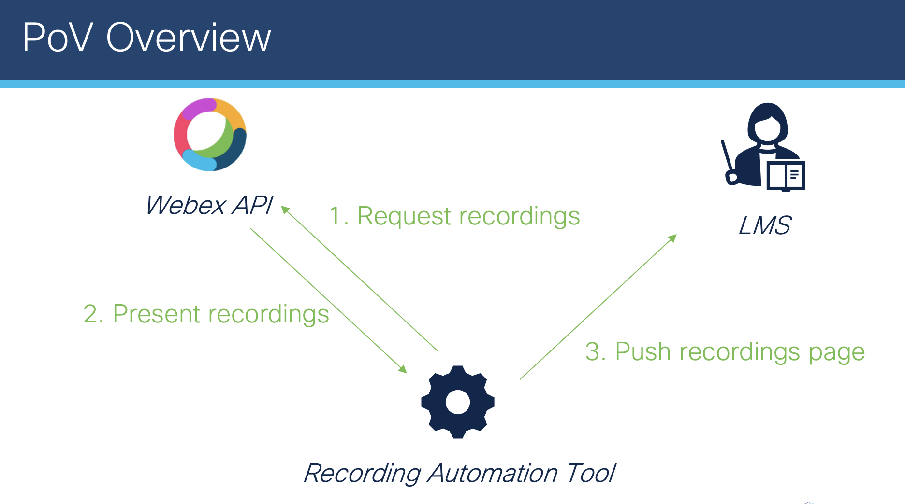
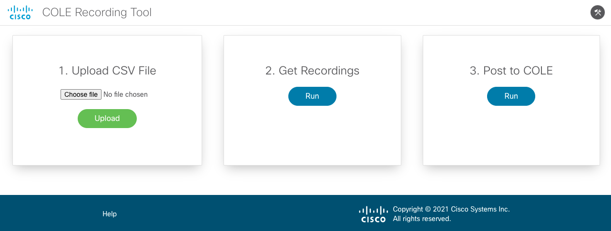

# gve_devnet_webex_recording_to_LMS

In this repository, we show how to automatically pull the latest recordings from the Webex Meetings API and create an HTML table that we upload to a page on our LMS. 



## Contacts
* Stien Vanderhallen (stienvan@cisco.com)
* Simon Fang (sifang@cisco.com)

## Solution Components
* Python
* Flask
* Webex Meetings API
* Canvas LMS API
* Deployment: Kubernetes, Docker

## Prerequisites

### Webex integration

*Reference: https://developer.webex.com/docs/integrations*

The Webex platform allows for quick creation of integrations, as used in this project to rertrieve recordings on behalf of a specific user. In creating a integration through the above provided link, a client ID and secret will be generated. *Save this information*, to use later for environment configuration. The rights to be granted to the integration are: `meeting:recordings_read`.

### Webex bot

*Reference: https://developer.webex.com/docs/bots*

The Webex platform allows for quick creation of notifier bots, as used in this project to inform the user of recordings being retrieved and posted to the LMS. In creating a bot through the above provided link, an API access token will be generated. *Save this token*, to use later for environment configuration.

## Installation/Configuration

1. Clone this repository: 

```
$ git clone https://github.com/gve-sw/gve_devnet_webex_recording_to_lms
```

2. Navigate into this repository: 

```
$ cd gve_devnet_webex_recording_to_lms
```

3. In `docker-compose.yml`, fill out the following environment variables:
      - **COLE_ACCESS_TOKEN** = Your COLE access token, as retrieved through browsing `Account > Settings > New Access Token` in the LMS. (ref: https://community.canvaslms.com/t5/Admin-Guide/How-do-I-manage-API-access-tokens-as-an-admin/ta-p/89)
      - **WEBEX_TOKEN** = Your Webex access token, as retrieved through your Webex integration
      - **WEBEX_REFRESH_TOKEN** = Your Webex refresh token, as retrieved through your Webex integration
      - **WEBEX_BOT_TOKEN** = Your Webex notifier bot token for access token renewal
      - **WEBEX_NOTIFIER_TOKEN** = Your Webex notifier bot token for recording updates
      - **COLE_URL** = Your COLE course URL
      - **WEBEX_CLIENT_ID** = Your Webex integration ID
      - **WEBEX_CLIENT_SECRET** = Your Webex integration secret
      - **WEBEX_ROOM_ID** = Your Webex room ID for bot notifications
      - **FROM_DATE** = Start date for recordings, e.g., "2020-07-27T09:30:00"
      - **TO_DATE** = End date for recordings, e.g., "2020-07-27T09:30:00"

## Usage

1. Install Docker Desktop

    https://www.docker.com/products/docker-desktop

2. Install Docker Compose

```
$ pip install docker-compose
```

3. Clone repository

```
$ git clone https://wwwin-github.cisco.com/stienvan/cole-recordings.git
$ cd cole-recordings
```

4. Build application

```
$ docker-compose down
$ docker-compose build
$ docker-compose up -d
```

5. Navigate to `localhost:8090`

6. Follow the steps displayed:
- **Step 1**: Upload a CSV file with module names, and groups to be added to the LMS. An example is included in `app/app/backend/meeting_list.csv`
- **Step 2**: Click the button to retrieve all recordings, and wait for a checkmark to appear.
- **Step 3**: Click the button to post to the LMS, and wait for a checkmark to appear.



### LICENSE

Provided under Cisco Sample Code License, for details see [LICENSE](LICENSE.md)

### CODE_OF_CONDUCT

Our code of conduct is available [here](CODE_OF_CONDUCT.md)

### CONTRIBUTING

See our contributing guidelines [here](CONTRIBUTING.md)

#### DISCLAIMER:
<b>Please note:</b> This script is meant for demo purposes only. All tools/ scripts in this repo are released for use "AS IS" without any warranties of any kind, including, but not limited to their installation, use, or performance. Any use of these scripts and tools is at your own risk. There is no guarantee that they have been through thorough testing in a comparable environment and we are not responsible for any damage or data loss incurred with their use.
You are responsible for reviewing and testing any scripts you run thoroughly before use in any non-testing environment.
